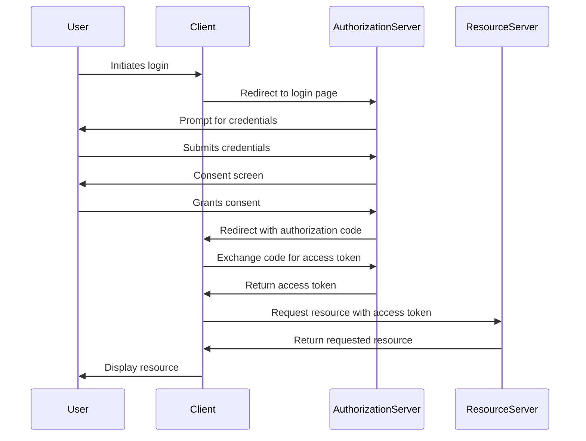
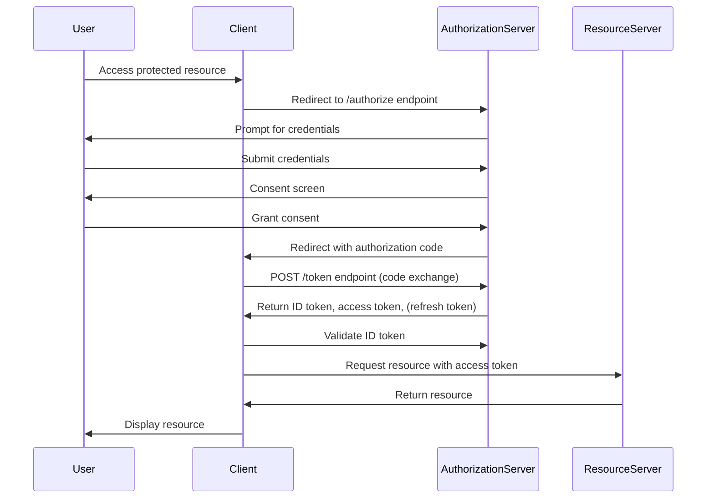
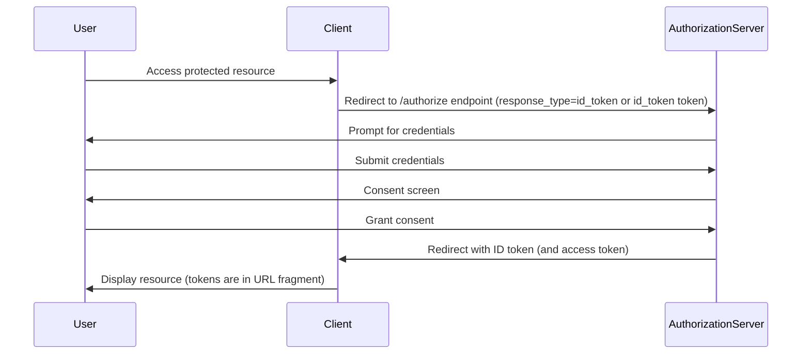
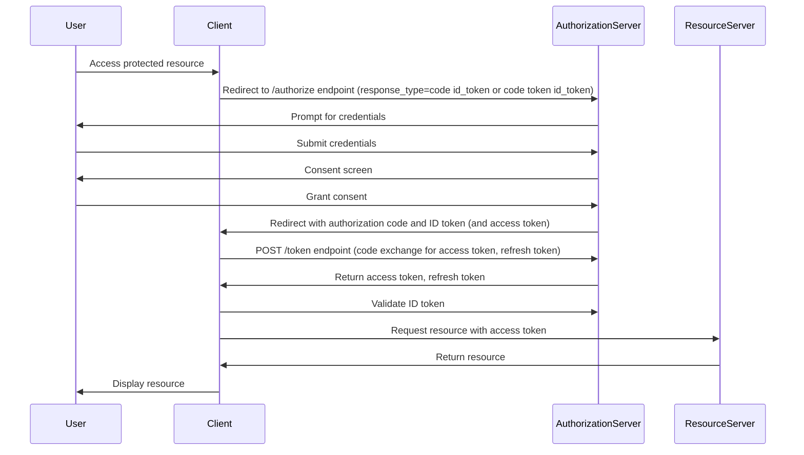
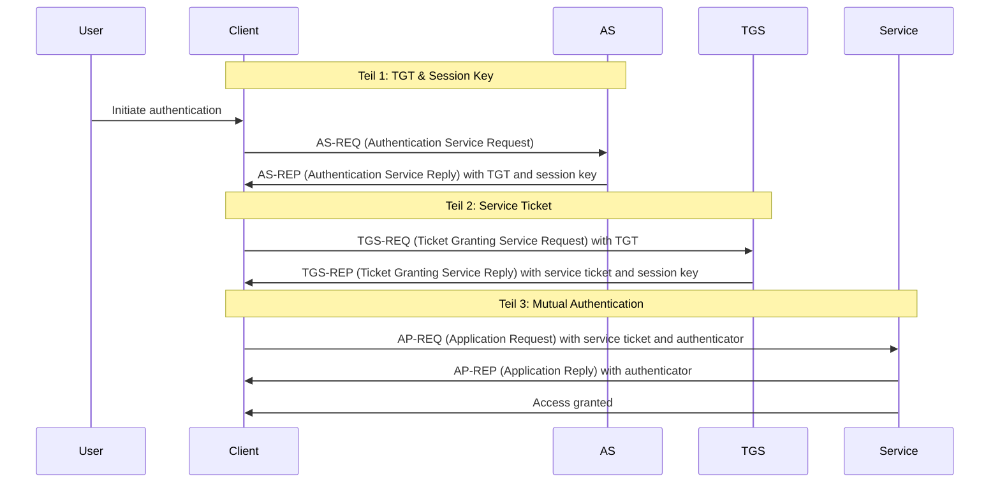

# super-duper-dollop

git checkout develop
git flow feature start navigation

## GIT

Create a feature branch with `git flow`

```sh
git flow feature start feature-name
```

Push branch to GitHub first time
```sh
git push -u origin feature/feature-name
```

After you make changes on some files `commit` them


```sh
git add . 
git commit -m "Tell what you have been doing in this commit and what you have changed"
```

Now you `push` changes to GitHub

```sh
git push
```

If you finished a feature and want to merge it into the develop branch, go to your project on GitHub, navigate to 'Pull request' and add a new Pullrequest from your feature branch to the develop branch. Now you can assign it to a person, which can look through your changes and recommand changes. When everone (or you as the admin) is happy with the changes, you can merge the pull request with the button on the bottom of the page.

And so you finally changed the project :tada:

## CSS

```css
text: text-decoration (none; underline), font-size (vw-height: percent, px, inherit)

```

## OAUTH



## OICD

Authorization Code Flow



Implicit flow




Hybrid Flow




## Kerberos




